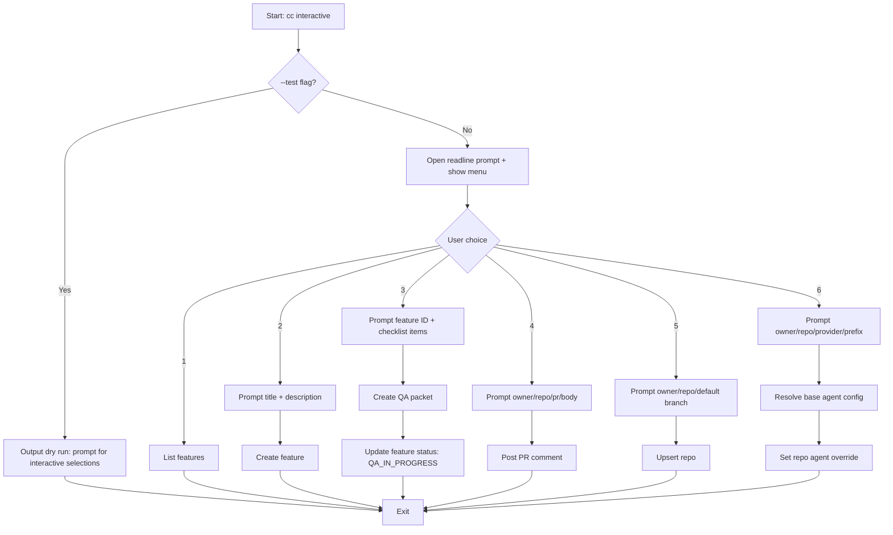

# DryDock Interactive CLI Flow

```mermaid
flowchart TD
  A[Start: cc interactive] --> B{--test flag?}
  B -->|Yes| C[Output dry run: prompt for interactive selections]
  C --> Z[Exit]
  B -->|No| D[Open readline prompt + show menu]
  D --> E{User choice}

  E -->|1| F[List features]
  F --> Z

  E -->|2| G[Prompt title + description]
  G --> H[Create feature]
  H --> Z

  E -->|3| I[Prompt feature ID + checklist items]
  I --> J[Create QA packet]
  J --> K[Update feature status: QA_IN_PROGRESS]
  K --> Z

  E -->|4| L[Prompt owner/repo/pr/body]
  L --> M[Post PR comment]
  M --> Z

  E -->|5| N[Prompt owner/repo/default branch]
  N --> O[Upsert repo]
  O --> Z

  E -->|6| P[Prompt owner/repo/provider/prefix]
  P --> Q[Resolve base agent config]
  Q --> R[Set repo agent override]
  R --> Z
```
